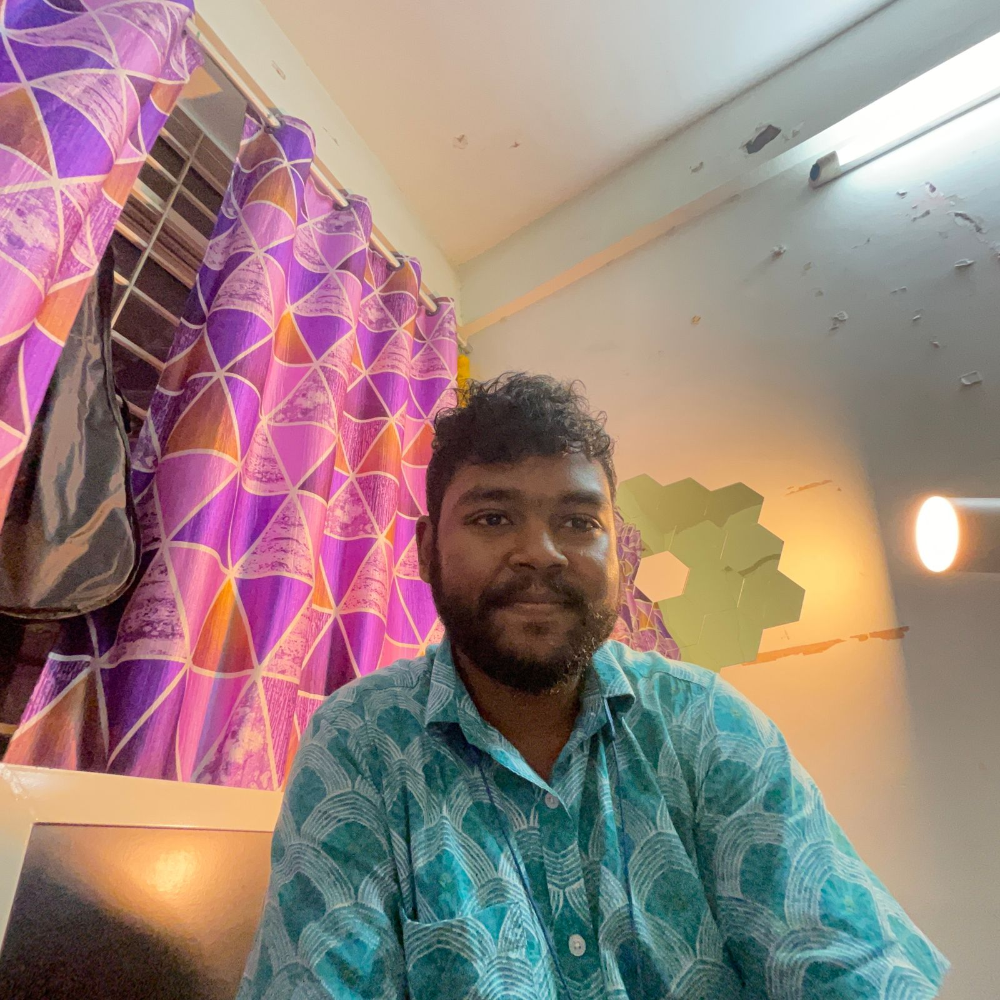

# About

My name is Roshan Kumar Dora.

- I was born in **Berhampur, Odisha**, but lived in **Talcher, Odisha** till the end of my schooling.

- I am currently residing in the city of **Bhopal, Madhya Pradesh**, where I am pursuing my Bachelor of Science-Master of Science in Physics at the [Indian Institute of Science Education and Research Bhopal](https://www.iiserb.ac.in/) (IISER-B).

- I have a range of interests in Physics lensed around Astronomy and Instrumentation, and currently I am interested in Gravitational Waves and Detector Instrumentation of Future Terrestrial Laser Interferometers.

- Apart from Academics, I am greatly interested in Music 🎼 in genres like Rock, Indie Pop, Indian Classical Music and my soul favourite, Carnatic Music. Also, I am an Av-Geek(someone who is fond of Aviation 🛫) and I love learning about flight dynamics and flight controls. 
